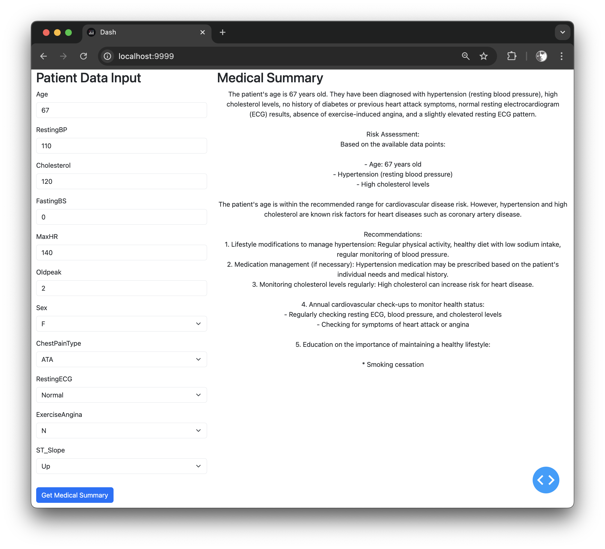

# dash-langchain-health-app
Demonstrate the use of LangChain and Dash for building AI applications in the healthcare sector using public dataset



## Application architecture

```
+--------------------+          +--------------------+          +--------------------+
|                    |          |                    |          |                    |
|    Dash App (UI)   | Input    |    LangChain       |  Query   |    Local LLM       |
|                    +--------->+   (LLMChain)       +--------->+  (e.g., GPT4All)   |
|                    |          | (Prompt Template & |          |                    |
|                    |          |     Processing)    |          |                    |
+--------------------+          +--------------------+          +---------+----------+
      ^       |                                                           |
      |       |                                                           |
      |       |       Response                                            |
      |       +----------------<------------------------------------------+
      |                                                                   |
      |                                                                   |
      +--------------------+          +--------------------+              |
                           |          |                    |              |
                           |          |    User Input      |              |
            Display Output +<---------+ (Patient Data)     |              |
                           |          |                    |              |
                           +----------+--------------------+--------------+
```

## **Explanation**

### **1. User Interface (Dash App or Streamlit App)**

- **Description:**
  - The user interacts with the application through a graphical user interface (GUI) built using either **Dash** or **Streamlit**.
  - The GUI allows the user to input patient data (age, sex, blood pressure, etc.).

- **Function:**
  - **Input Collection:** Collects patient data through form fields.
  - **Display Output:** Displays the medical summary and recommendations generated by the LLM.

### **2. LangChain (LLMChain)**

- **Description:**
  - **LangChain** is a framework that facilitates interaction with language models.
  - It uses a **Prompt Template** to format the input data into a prompt that the LLM can understand.
  - The **LLMChain** manages the flow between the input data, the prompt, and the LLM's response.

- **Function:**
  - **Prompt Construction:** Converts patient data into a formatted prompt using the **Prompt Template**.
  - **Processing:** Sends the prompt to the Local LLM and processes the response.
  - **Response Handling:** Receives the output from the LLM and passes it back to the user interface for display.

### **3. Local LLM (Language Model)**

- **Description:**
  - A **Local Language Model** like **GPT4All** or **LLaMA** running on your machine.
  - This example uses the [Qwen2-1.5B-Instruct]('https://huggingface.co/Qwen/Qwen2-1.5B-Instruct') model.
  - Responsible for generating the medical summary based on the input prompt.

- **Function:**
  - **Computation:** Processes the prompt and generates a coherent, contextually relevant response.
  - **Output Generation:** Provides the medical summary, risk assessment, and recommendations.

## **Data Flow Steps**

1. **User Inputs Data:**

   - The user enters patient information into the **Dash** or **Streamlit** app.

2. **Data Sent to LangChain:**

   - The application sends this data to **LangChain**'s **LLMChain** component.

3. **Prompt Construction:**

   - **LLMChain** uses a **Prompt Template** to format the patient data into a natural language prompt.

4. **Interaction with Local LLM:**

   - The formatted prompt is sent to the **Local LLM** for processing.

5. **LLM Generates Response:**

   - The **Local LLM** generates a medical summary, assessing heart disease risk and providing recommendations.

6. **Response Returned to LangChain:**

   - The generated text is returned to **LangChain**.

7. **Display Output:**

   - **LangChain** passes the response back to the **Dash** or **Streamlit** app.
   - The application displays the medical summary to the user.

## **Detailed Integration**

### **A. User Interface Layer**

- **Dash App:**
  - Uses **Dash Core Components** and **Dash HTML Components** to create input forms.
  - **Callbacks** are defined to handle user interactions and update outputs.

### **B. LangChain Integration**

- **PromptTemplate:**
  - A template that defines how patient data is formatted into a prompt.
  - Example:
    ```
    You are an AI assistant specialized in cardiology.

    Given the patient data:
    {patient_data}

    Provide a medical summary, assess the risk of heart disease, and suggest recommendations.

    Medical Summary:
    ```

- **LLMChain:**
  - Combines the prompt template with the LLM to process inputs and generate outputs.
  - Manages the end-to-end interaction between the user input and the LLM response.

### **C. Local LLM Processing**

- **Model Initialization:**
  - The LLM is loaded locally using library `GPT4All`.
  - The model file (e.g., `ggml-gpt4all-j-v1.3-groovy.bin` for GPU inferencing or `qwen2-1_5b-instruct-q4_0.gguf` from GPT4ALL optimized for CPU inferencing) is required and loaded into memory.

- **Response Generation:**
  - The LLM receives the formatted prompt and generates a textual response.
  - The response is designed to be coherent and relevant to the patient's data.

## **Technology Stack Summary**

- **Dash and Dash Bootstrap Components:**
  - For building responsive and interactive web applications.
  - Provides a layout and styling for the input forms and output displays.

- **LangChain:**
  - Bridges the application and the language model.
  - Simplifies prompt management and interaction with the LLM.

- **Local LLM (e.g., GPT4All, LLaMA):**
  - Performs the heavy lifting of natural language processing.
  - Runs locally to ensure data privacy and control.

## **Benefits of This Integration**

- **Modularity:**
  - Each component (UI, LangChain, LLM) is modular, making the system easier to maintain and extend.

- **Scalability:**
  - The architecture allows for swapping components (e.g., using a different LLM) without significant changes to the overall system.

- **Privacy:**
  - Running the LLM locally ensures that sensitive patient data does not leave the local environment.

- **User-Friendly Interface:**
  - Dash and Streamlit provide intuitive interfaces for users who may not be technically inclined.

## **Possible Extensions and Additonal Notes**

- **Add a Database Layer:**
  - Store patient data and LLM responses for future reference or auditing.

- **Implement Authentication:**
  - Secure the application by adding user authentication and authorization mechanisms.

- **Enhance the LLM:**
  - Fine-tune the language model on medical texts to improve the quality of the summaries.

- **Integrate Machine Learning Models:**
  - Incorporate predictive models (e.g., logistic regression, neural networks) to provide quantitative risk assessments alongside the LLM's summaries.

- **Error Handling:**
  - Implement robust error handling in each layer to manage exceptions and provide feedback to the user.

- **Performance Optimization:**
  - Optimize the LLM's performance by using appropriate model sizes and utilizing hardware accelerations like GPUs if available.

- **Compliance and Ethics:**
  - Ensure that the application complies with healthcare regulations and ethical guidelines, especially concerning data privacy and the accuracy of medical advice.

## Dataset Selection and Data Preparation

### Load the Dataset

Uses the UCI Heart Disease Dataset available publicly and added in the repo file 'heart.csv'.

heart.csv head:
```
Age,Sex,ChestPainType,RestingBP,Cholesterol,FastingBS,RestingECG,MaxHR,ExerciseAngina,Oldpeak,ST_Slope,HeartDisease
40,M,ATA,140,289,0,Normal,172,N,0,Up,0
```

### Data Preprocessing

Prepare the data for modeling and check for missing values. Proceed if there are no missing values.

1. Initialize LabelEncoders
1. Separate features and target
1. Save the LabelEncoders to 'label_encoders.joblib'
1. Save the StandardScaler to 'scaler.joblib'

## Dash app

### **Building and Running the Docker Image**

#### **Step 1: Build the Docker Image**

```bash
docker build -t dash-app .
```

#### **Step 2: Run the Docker Container**

```bash
docker run -p 8050:8050 dash-app
```

#### **Step 3: Access the App**

Open your web browser and navigate to `http://localhost:8050` to view your Dash app.

### **Important Considerations**

#### **Model File Handling**

- **Include Model File in the Docker Image (not recommended):**

  - Copy your model file into the Docker image by adding a line in the `Dockerfile`:

    ```Dockerfile
    # Copy the model file into the container
    COPY qwen2-1_5b-instruct-q4_0.gguf /app/
    ```

  - Make sure the model file is in the same directory as your `Dockerfile`.

- **Model File Size:**

  - Be aware that including large model files can increase the size of your Docker image significantly.

- **Mount Volume for Model File (recommended)**

  - Instead of copying the model file into the image, you can mount a volume when running the container:

    ```bash
    docker run -p 8050:8050 -v /path/to/model/files:/models dash-app
    ```

  - Replace `/path/to/model/files` with the directory on your host where the model file is located.

#### **GPU Support (If Applicable)**

- If you're using a model that requires GPU support and your host has a GPU, you need to set up Docker to use NVIDIA's runtime.

  - Install NVIDIA Container Toolkit: [Instructions](https://docs.nvidia.com/datacenter/cloud-native/container-toolkit/install-guide.html)

  - Run the container with GPU support:

    ```bash
    docker run --gpus all -p 8050:8050 dash-app
    ```

- **Note:** This requires additional configuration and is only applicable if you're using GPU resources.

#### **Environment Variables and Configuration**

- If your app requires specific environment variables or configurations, you can set them in the `Dockerfile` or when running the container.

- **Example:** Setting environment variables in `Dockerfile`:

  ```Dockerfile
  ENV VARIABLE_NAME=value
  ```

- **Example:** Passing environment variables when running the container:

  ```bash
  docker run -p 8050:8050 -e VARIABLE_NAME=value dash-app
  ```
